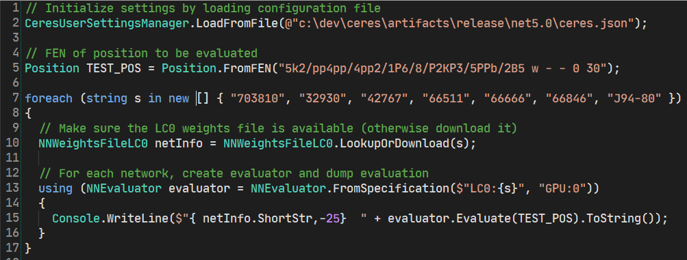
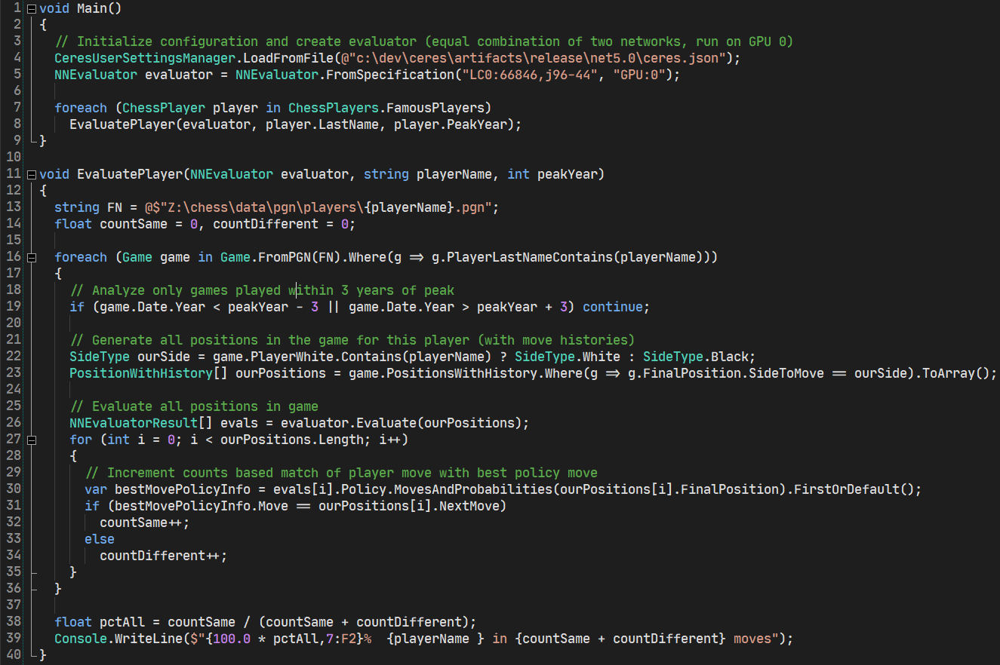
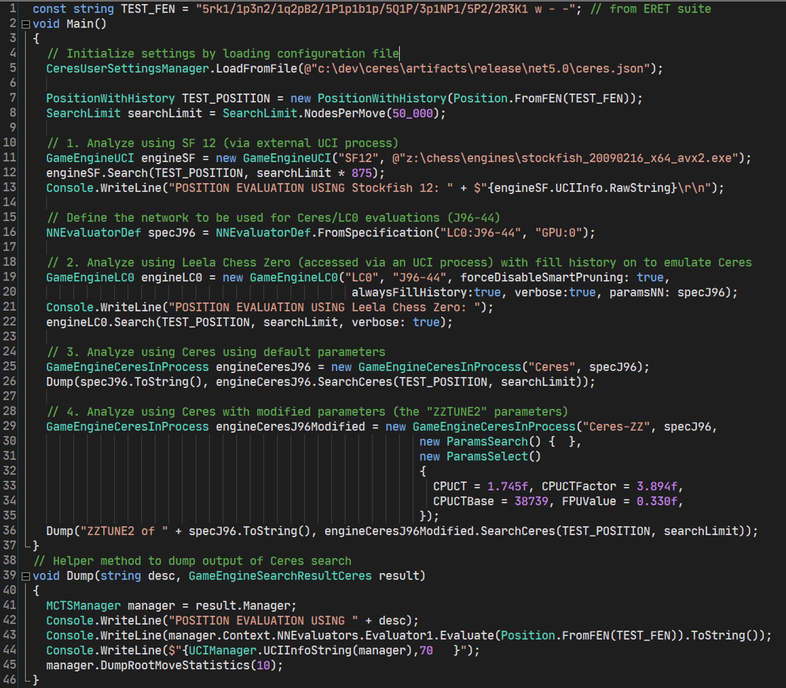

## Ceres API Sample Code

The following three code samples demonstrate some of the 
flexibility of the Ceres API for conducting chess research efficiently. The 
code snippets were written inside the very convenient 
Linqpad tool (https://www.linqpad.net/):


### Comparing Analysis across multiple networks

This first simple sample dumps an overview of the single node analysis
of the position after Bobby Fischer's infamous blunder in Game 1
of the World Championship match. It demonstrates
that progressively more advanced versions of the Leela Chess Zero networks
do a monotonically increasing better job of understanding
in a single-node analysis that the pawn move g2g3 trapping
the bishop is best.



```
703810: 10x128 WDL MLH     <NNPositionEvaluation V= -0.18 Policy= g2g3 [ 27.26%]  e3e4 [ 25.91%]  f2f4 [ 12.23%]  c1b2 [ 10.50%]  a3a4 [  7.08%] >
32930: 20x256              <NNPositionEvaluation V= -0.10 Policy= g2g3 [ 57.32%]  f2f4 [ 26.45%]  a3a4 [  4.70%]  e3e4 [  4.22%]  c1d2 [  1.35%] >
42767: 20x256              <NNPositionEvaluation V= -0.16 Policy= g2g3 [ 75.53%]  f2f4 [  6.50%]  e3e4 [  5.73%]  a3a4 [  3.82%]  d3e2 [  2.82%] >
66511: 24x320 WDL MLH      <NNPositionEvaluation V=  0.01 Policy= g2g3 [ 82.32%]  a3a4 [  3.68%]  e3e4 [  3.56%]  f2f4 [  3.19%]  c1b2 [  1.37%] >
66666: 30x384 WDL MLH      <NNPositionEvaluation V=  0.15 Policy= g2g3 [ 85.61%]  f2f4 [  7.91%]  e3e4 [  1.30%]  a3a4 [  1.07%]  d3e2 [  0.72%] >
66846: 30x384 WDL MLH      <NNPositionEvaluation V=  0.20 Policy= g2g3 [ 87.23%]  f2f4 [  6.93%]  e3e4 [  1.05%]  a3a4 [  0.88%]  d3e2 [  0.66%] >
J94-80: 30x384 WDL MLH     <NNPositionEvaluation V=  0.51 Policy= g2g3 [ 90.22%]  f2f4 [  4.09%]  a3a4 [  0.98%]  e3e4 [  0.98%]  d3e2 [  0.70%] >
```


### Human grandmaster move agreement analysis 
The second sample extracts a large subset of games from a set
of top chess players in history and compares their actual moves made
against an LC0 policy network, quantifying the aggrement to 
assess their strength and/or similarity to the playing style of 
the Leela networks.



After a couple of minutes of execution the following intriguing results are output:

```
  60.91%  Anand in 26201 moves
  59.75%  Fischer in 6760 moves
  59.74%  Carlsen in 36374 moves
  59.62%  Kasparov in 24645 moves
  58.89%  Capablanca in 5519 moves
  58.29%  Tal in 15604 moves
  58.20%  Caruana in 56363 moves
  57.78%  Topalov in 24941 moves
  57.71%  Euwe in 7543 moves
  57.50%  Kramnik in 31972 moves
  56.47%  Korchnoi in 17275 moves
  56.42%  Lasker in 9844 moves
  56.39%  Nakamura in 66737 moves
  56.15%  Karpov in 38493 moves
  55.39%  Smyslov in 13718 moves
  55.22%  Portisch in 15675 moves
  54.95%  Huebner in 12144 moves
  54.94%  Alekhine in 21984 moves
  54.85%  Botvinnik in 5404 moves
  54.77%  Reshevsky in 8059 moves
  53.66%  Pachman in 4210 moves
  52.07%  Petrosian in 13968 moves
```


### Deep position analysis (with varied CPUCT search parameters)
The third example analyzes one chess position using mulitple
engines including Stockfish, Leela, the default Ceres engine,
and a version of the Ceres engine configured with a different
set of CPUCT tuning parameters. Detailed root move statistics
are dumped for each of the neural network based searches
to facilitate analysis and interpretation.
 


```
POSITION EVALUATION USING Stockfish 12: info depth 36 seldepth 58 multipv 1 score cp 443 nodes 43750282 nps 1662055 hashfull 1000 tbhits 0 time 26323 
				             pv f3e5 b6d6 b5b6 f5e4 f4d2 f7e5 d2g5 e5g6 c1c7 f8f7 c7c8 f7f8 g5h6 d6e7 f6e7 f8c8 e7g5 c8a8 f2f3 e4f5 
             				     


POSITION EVALUATION USING Leela Chess Zero: 
<LC0VerboseMoveStats  node Visits=50226 V = 0.4464 P=100 Q=0, U=0 [48]
<LC0VerboseMoveStats  f3e5 Visits=45309 V = 0.7364 P=16.68 Q=0, U=0.00484 [588]
<LC0VerboseMoveStats  f6e7 Visits=1400 V = 0.4465 P=8.93 Q=0, U=0.08379 [1317]
<LC0VerboseMoveStats  c1c7 Visits=1255 V = 0.6349 P=14.45 Q=0, U=0.15133 [70]
<LC0VerboseMoveStats  f6d4 Visits=876 V = 0.6955 P=9.85 Q=0, U=0.14777 [1299]
<LC0VerboseMoveStats  f6b2 Visits=498 V = 0.5347 P=3.87 Q=0, U=0.10186 [1295]
<LC0VerboseMoveStats  f6a1 Visits=166 V = 0.4423 P=2.71 Q=0, U=0.21317 [1293]
...


POSITION EVALUATION USING <NNEvaluatorDef Network=LC0:J96-44 Device=GPU:0 >
<NNPositionEvaluation V=  0.45 Policy= f3e5 [ 28.62%]  c1c7 [ 22.64%]  f6d4 [ 12.33%]  f6e7 [ 10.52%]  f6c3 [  5.92%] >
info depth 12 seldepth 23 time 9639 nodes 41858 score cp 63 tbhits 0 nps 4343 pv f3e5 b6d6 b5b6 f8a8 g3g4 h5g4 c1c7 d3d2 c7f7 d2d1q g1h2 

VERBOSE ROOT MOVE STATISTICS
     0 (none)   100.00%  N=    41858  Q=-0.389  V= 0.446  WDL= 0.53 0.39 0.08  WDL Avg= 0.53 0.32 0.14  M =   78   63  
     1 f3e5      16.89%  N=    34811  Q= 0.428  V= 0.730  WDL= 0.04 0.20 0.77  WDL Avg= 0.14 0.30 0.56  M =   60   58  
S    1 c1c7      14.59%  N=     2086  Q= 0.256  V= 0.632  WDL= 0.05 0.27 0.68  WDL Avg= 0.18 0.39 0.43  M =   66   68  
S    1 f6d4      10.02%  N=     1408  Q= 0.256  V= 0.692  WDL= 0.04 0.23 0.73  WDL Avg= 0.17 0.41 0.42  M =   70   89  
S    1 f6e7       9.07%  N=     1350  Q= 0.258  V= 0.446  WDL= 0.08 0.40 0.52  WDL Avg= 0.12 0.50 0.38  M =   78   94  
S    1 f6b2       3.92%  N=      547  Q= 0.256  V= 0.534  WDL= 0.06 0.35 0.59  WDL Avg= 0.14 0.47 0.40  M =   76   95  
S    1 f3g5       5.79%  N=      353  Q= 0.160  V= 0.494  WDL= 0.07 0.36 0.57  WDL Avg= 0.17 0.50 0.33  M =   74   88  
S    1 f6c3       6.35%  N=      351  Q= 0.146  V= 0.483  WDL= 0.07 0.39 0.55  WDL Avg= 0.14 0.57 0.29  M =   81   90  
S    1 f6a1       2.75%  N=      210  Q= 0.196  V= 0.442  WDL= 0.07 0.42 0.51  WDL Avg= 0.15 0.51 0.34  M =   81   92  
S    1 g3g4       2.94%  N=      113  Q= 0.069  V= 0.538  WDL= 0.06 0.34 0.60  WDL Avg= 0.23 0.47 0.30  M =   66   76  
S    1 f3d4       3.55%  N=      102  Q=-0.027  V= 0.155  WDL= 0.15 0.55 0.30  WDL Avg= 0.25 0.53 0.22  M =   89   75  
  (followed by 38 additional moves not shown...)

-----------------------------------------------------------------------------------------------------------------


POSITION EVALUATION USING ZZTUNE2 of <NNEvaluatorDef Network=LC0:J96-44 Device=GPU:0 >
<NNPositionEvaluation V=  0.45 Policy= f3e5 [ 28.62%]  c1c7 [ 22.64%]  f6d4 [ 12.33%]  f6e7 [ 10.52%]  f6c3 [  5.92%] >
info depth 7 seldepth 15 time 7421 nodes 46245 score cp 25 tbhits 0 nps 6231 pv f6e7 f8a8 c1c7 d3d2 f3d2 b6b5 e7f6 b5e2 c7b7 a8c8 d2f3 

VERBOSE ROOT MOVE STATISTICS
     0 (none)   100.00%  N=    46245  Q=-0.176  V= 0.446  WDL= 0.53 0.39 0.08  WDL Avg= 0.44 0.30 0.26  M =   78   72  
     1 f6e7       9.07%  N=    31844  Q= 0.226  V= 0.451  WDL= 0.08 0.40 0.53  WDL Avg= 0.23 0.30 0.46  M =   78   72  
S    1 f3e5      16.89%  N=     5062  Q= 0.095  V= 0.730  WDL= 0.04 0.20 0.77  WDL Avg= 0.30 0.30 0.40  M =   60   69  
S    1 f6d4      10.02%  N=     2595  Q= 0.095  V= 0.692  WDL= 0.04 0.23 0.73  WDL Avg= 0.31 0.28 0.41  M =   70   74  
S    1 c1c7      14.59%  N=     1751  Q= 0.019  V= 0.632  WDL= 0.05 0.27 0.68  WDL Avg= 0.39 0.21 0.41  M =   66   44  
S    1 f6c3       6.35%  N=      967  Q= 0.089  V= 0.483  WDL= 0.07 0.39 0.55  WDL Avg= 0.28 0.36 0.37  M =   81   72  
S    1 f6b2       3.92%  N=      802  Q= 0.099  V= 0.535  WDL= 0.06 0.35 0.59  WDL Avg= 0.28 0.33 0.38  M =   76   74  
S    1 f6e5       1.47%  N=      678  Q= 0.109  V= 0.335  WDL= 0.09 0.49 0.42  WDL Avg= 0.27 0.35 0.38  M =   73   67  
S    1 f6a1       2.75%  N=      563  Q= 0.098  V= 0.442  WDL= 0.07 0.42 0.51  WDL Avg= 0.29 0.32 0.39  M =   81   74  
S    1 f3g5       5.79%  N=      305  Q=-0.076  V= 0.494  WDL= 0.07 0.36 0.57  WDL Avg= 0.43 0.23 0.35  M =   74   63  
S    1 f3d4       3.55%  N=      208  Q=-0.016  V= 0.155  WDL= 0.15 0.55 0.30  WDL Avg= 0.32 0.37 0.31  M =   89   70  
  (followed by 38 additional moves not shown...)

-----------------------------------------------------------------------------------------------------------------
```