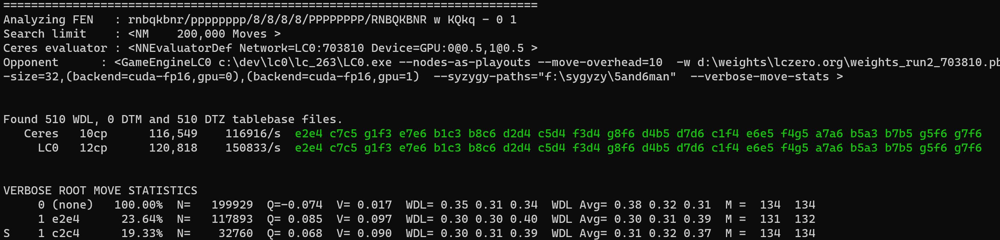
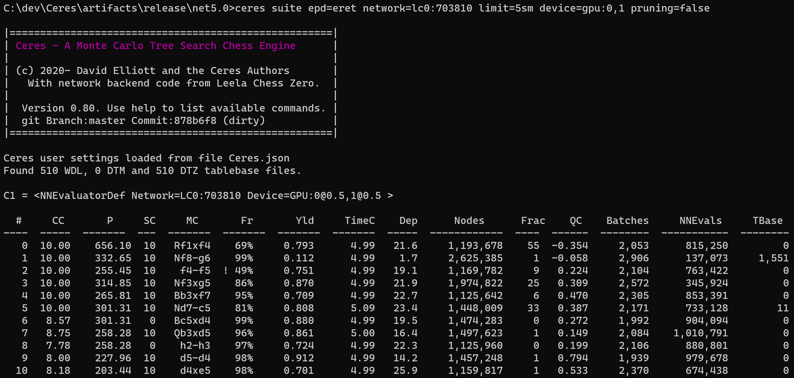
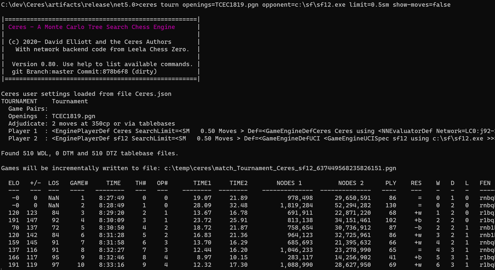

# Ceres Feature Commands

## Introduction
When executing the Ceres executable from the command line, 
one of the following command verbs can be optionally
specified as the first argument:

*  UCI -  Run in UCI Engine Mode (equivalently omit this subcommand)
*  ANALYZE -  Run search on specified FEN position and dump detailed move statistics and principal variation at end of search.
*  TOURN - Run a tournament of games between Ceres and (possibly) another external UCI chess engine.
*  SUITE - Run search on all positions in a suite of test positions from an EPD file and quantify agreement with specified correct moves.
*  SYSBENCH - Runs CPU and GPU benchmarks and dumps summary result to console.
*  SETOPT - Modify a specified option in the Ceres configuration file with a given value.
*  SETUP - Prompts for user settings and initializes a new Ceres.json configuration file with these values.

It is also possible to access the functionality of these commands
programmatically via the Ceres API. Documentation on these APIs 
will be made available in the near future.

## Command Line Options

Most of the commands accept one or more options following the command.
To see which options are supported by each of the commands, simply run Ceres with the HELP command.

These options include:

NETWORK sets the network to be used (if omitted, network specified in the options file is used).
The value consists of a network type code (currently only LC0 is supported) followed
colon and then a comma-separated list of one or more network IDs (which are ensembled if multiple).
For  example:
```
network=LC0:703810
network=LC0:703810@0.25,42767@0.75
```
the first would resolve to the Leela weights file weights_run2_703810.pb located in the configured LC0 network directory
and the second would be build a weighted ensemble of two networks.

DEVICE sets the neural network inferencing hardware device(s) to be used (if omitted, 
the device specified in the options file is used). The value consists of a device type 
identifier (currently only GPU is supported) followed by a colon and a comma-separated list of
one or more device IDs. For example:
```
device=GPU:0
device=GPU:0,1
device=GPU:0@0.66,1@0.34
```
the first example uses GPU 0 only, the second splits batches equally between GPUs 0 and 1, 
and the third splits batches in 66% and 34% fractions between GPUs 0 and 1, respectively

LIMIT is a string specifying the limiting parameters for a search and consists
of a number (with optional underscores for readability) followed by a unit specifier which must be one of:
* SM (seconds per move)
* NM (nodes per move)
* SG (seconds per game)
* NG (nodes per game) - supported only by Ceres engines

For example:
```
limit=100_000nm
limit=10sm
```

OPPONENT is either the keyword CERES (to play against another in-process Ceres engine instance),
or the keyword LC (to launch the LC0 engine from the configured LC0 binaries directory), 
or the full path to an executable chess engine that supports the UCI protocol.

NETWORK-OPPONENT is of the same format of NETWORK and can be used to override the network 
used with an opponent (if of type CERES or LC0).

Similarly, DEVICE-OPPONENT is of the same format of NETWORK and can be used to override the network 
used with an opponent (if of type CERES or LC0).


PRUNING is a boolean either true or false indicating of searches should be performed with 
top-level futility move pruning (called "smart pruning" by LC0) should be enabled (default true).

EPD is supported (and required) only by the SUITE command and specifies the name of the EPD file
containing the test positions. The directory configured in the Ceres.json or using 
the SETOPT command with the key "dir-epd" for example:
```
ceres setopt dir-epd=\\synology\dev\chess\data\epd
```

OPENING is supported (and required) only by the TOURN command and specifies the PGN file containing
opening positions for games. The directory can be set using the option dir-pgn (analagous to the dir-epd example above).


SHOW-MOVES is a boolean either true or false and determines if move-level detail is output to the conole in touranment mode.


## Command Details

Shown below are examples for each of the major commands.

### UCI

Ceres enters a UCI command loop if executed without arguments or 
with the single argument UCI.  If UCI is specified it can optionally
be followed by the NETWORK and/or DEVICE key/value pairs to
override the default settings in the configuation file.

Most UCI commands are supported, but notably not including:
* pondering
* multipv
* set option

Several nonstandard UCI commands are supported by Ceres:
* dump-move-stats shows the statistics asssociated with each of the top-level moves from the last search
* dump-pv dumps details about the principal variation associated with the last search
* dump-time dumps statistic about the timing of the last search
* dump-params dumps all internal parameter values associated with MCTS and leaf selection


A sample UCI session is shown here:

```
C:\dev\Ceres\artifacts\release\net5.0>ceres UCI network=lc0:j92-280

|=====================================================|
| Ceres - A Monte Carlo Tree Search Chess Engine      |
|                                                     |
| (c) 2020- David Elliott and the Ceres Authors       |
|   With network backend code from Leela Chess Zero.  |
|                                                     |
|  Version 0.80. Use help to list available commands. |
|  git Branch:master Commit:9959d85 (dirty)           |
|=====================================================|


Ceres user settings loaded from file Ceres.json
Network evaluation configured to use: <NNEvaluatorDef Network=LC0:j92-280 Device=GPU:0@0.5,1@0.5 >

Entering UCI command processing mode.
go nodes 100000
info depth 0 seldepth 1 time 1836 nodes 1 score cp 15 tbhits 0 nps 1 pv e2e4  string M= 135
info depth 6 seldepth 17 time 2336 nodes 5153 score cp 8 tbhits 0 nps 2206 pv e2e4 e7e5 g1f3 b8c6 f1b5 g8f6 e1g1 f6e4 f1e1 e4d6 f3e5 f8e7 b5f1 e8g8 e5f3 d6f5 b1c3  string M= 136
info depth 8 seldepth 25 time 2837 nodes 33629 score cp 9 tbhits 0 nps 11852 pv e2e4 e7e5 g1f3 b8c6 f1b5 g8f6 e1g1 f6e4 f1e1 e4d6 f3e5 f8e7 b5f1 d6f5 e5f3 e8g8 b1c3 d7d5 d2d4 f5h4 f3h4 e7h4 c3e2 c6e7 e2f4  string M= 136
info depth 9 seldepth 27 time 3342 nodes 69994 score cp 8 tbhits 0 nps 20945 pv e2e4 e7e5 g1f3 b8c6 f1b5 g8f6 e1g1 f6e4 f1e1 e4d6 f3e5 f8e7 b5f1 d6f5 e5f3 e8g8 b1c3 d7d5 d2d4 f5h4 f3h4 e7h4 c3e2 c6e7 e2f4 c7c6 c2c3  string M= 136
info depth 10 seldepth 27 time 3732 nodes 99937 score cp 9 tbhits 0 nps 26779 pv e2e4 e7e5 g1f3 b8c6 f1b5 g8f6 e1g1 f6e4 f1e1 e4d6 f3e5 f8e7 b5f1 c6e5 e1e5 e8g8 d2d4 e7f6 e5e1 f8e8 c2c3 e8e1 d1e1 d8e7 e1d1 b7b6 c1f4  string M= 136
bestmove e2e4
```


### SYSBENCH
The SYSBENCH command performs a basic hardware test on CPU and GPU,
benchmarking the CPU speed and also listing and benchmarking each of the
NVIDIA GPUs installed.

```
C:\dev\Ceres\artifacts\release\net5.0>Ceres.exe SYSBENCH

-----------------------------------------------------------------------------------
CPU BENCHMARK
   2,245,647 ops/second,         0 bytes alloc/op : MGPosition.FromPosition
     464,471 ops/second,     1,127 bytes alloc/op : MGChessPositionFromFEN
 156,306,321 ops/second,         0 bytes alloc/op : MGChessMoveToLZPositionMove
 103,889,390 ops/second,         0 bytes alloc/op : ZobristHash

CERES CPU BENCHMARK SCORE:  100

-----------------------------------------------------------------------------------
GPU BENCHMARK (benchmark net: LC0:703810)

ID  Name                Ver  SMClk  GPU%  Mem%   Temp   Throttle Reasons   NPS 1  NPS Batch
--  ------------------  ---  -----  ----  ----   ----   ----------------   -----  ---------
 0  TITAN RTX           75     300    0%    0%    31C   GpuIdle              892     82,747
 1  TITAN V             70     135    0%    0%    32C   GpuIdle            1,526     87,628
```

### ANALYZE
The ANALYZE command runs a search on single position specified as a FEN string 
at the end of the command line. Status lines (in UCI format) will be output periodically
during search. At the end of search statistics relating to the top-level moves and also
a dump of the PV (principal variation) will be output. It is also possible to specify
an opponent (such as "LC0") on the command line, causing two searches to execute
concurrently (Ceres and the opponent). UCI status lines from both engines will be output,
with color coding showing the moves of agreement or disagreement in their PVs.

```
C:\dev\Ceres\artifacts\release\net5.0>ceres ANALYZE network=lc0:703810 device=gpu:0,1 opponent=lc0 limit=200000nm startpos
```



The full detail of the output from the above command is shown here:
[full output](./text/command_analyze_output.txt).

Each line in the output is a position.

The columns in the output are:
* Dep - the search depth
* T - "C" for checkmate, "D" for draw
* #M - The number of moves considered
* FirstVisit - when was this node created during the search
* MvWh - Move for white to get to this position
* MvBl - Move for black to get to this position
* N - The number of visits to this node during the search
* Visits - The percentage number of visits to this node from the parent
* Policy - The policy probability of this node
* V - the node value
* Q - the sum of values from children divided by the number of visits to children
* WPos - the win probability of this position (without search)
* DPos - the draw probability of this position
* LPos - the loss probability of this position
* WTree - the win probability of this subtree (i.e. after search)
* DTree - the draw probability of this subtree
* LTree - the loss probability of this subtree
* MPos - the estimated number of moves left in the position (without search)
* MTree - the estimated number of moves left in this subtree (after search)
* FEN - the position for this node

### SUITE
The SUITE command takes a set of test positions from an EPD file which also contains
the correct move(s) and tests each position using searches conducted by Ceres 
and possibly also an opponent engine (such as LC0).

For example:


As another example we run the 103 test positions of the Eigenmann Rapid Engine Test (ERET) suite 
as described in https://glarean-magazin.ch/2017/03/05/computerschach-testaufgaben-engines-eigenmann-rapid-engine-test-eret/.
using two GPUs with a comparision against Leela Chess Zero

The most important columns in the [output](./text/command_suite_output.txt) are:
* CEx - cumulative score attained by external engine (Leela)
* CC  - cumulative score attained by Ceres
* TimeEx - search time in seconds for external engine
* TimeC  -search time for Ceres


### TOURN

The TOURN command runs a tournament of games played by Ceres versus a specified opponent engine,
using opening positions taken from a specified opening book. The results of the 
tournament are logged to the console and also the games are written to a PGN file on disk.

In this example we run a tournament between Ceres and Stockfish 12.



Additional features to speed up testing are available when running tournaments or suites
from the C# API, for example:
* Searches can be multithreaded, including optionally a pooled evaluator which gathers possibly 
 many small batches from a large number of concurrent searches, thereby 
reducing the latency drag.
* Position evaluations can be shared across opponents


### SETOPT
The SETOPT command modifies one of the Ceres configuration settings (stored in Ceres.json).

The following examples demonstrates setting the directory containing the Syzygy tablebases.

```
C:\dev\Ceres\artifacts\release\net5.0>ceres setopt dir-tablebases=f:\syzygy\5and6man

Ceres user settings loaded from file Ceres.json
Set dir-tablebases to f:\syzygy\5and6man
Updating default Ceres settings file Ceres.json
```
