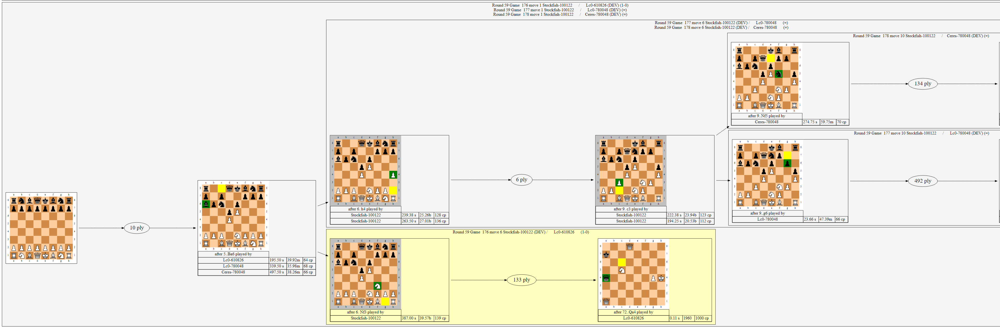

# Ceres Game Comparison Feature

## Introduction

**NOTE: This feature is current in beta test and requires building from source code. Only Windows has been tested so far. Feedback is welcomed.**

The Ceres game comparison graphically compares 2 or more games (typically from the same round in a tournament)
by identifying the position(s) within the game where the moves deviated among players.
This feature facilitates isolating where the various engines played different,
and the ancillary information such as game outcome and state of engine analysis at the time of the deviation.


## Prerequsites
There are two preparatory steps required to use this feature:
- install the Graphviz software from https://graphviz.org/download/ (typically using the linked "graphviz-2.50.0 (64-bit) EXE installer"). When prompted, it is suggested to set the PATH for all users.
- add a new line to Ceres.json referencing the location of these binaries. For example:
```
"DirGraphvizBinaries":"C:\Program Files (x86)\Graphviz\bin"
```

## Generating Graphs
The graph feature is triggered by issuing the command "gamecomp" at the UCI prompt. 
This must be immediately followed by the full path to a PGN file containing the games to be analyzed.
Optionally this can be followed by the indices of the desired games or rounds.
If no indicies are specifed, then graphs for all games (group by round) are generated. 
(Beware that for PGN with many games this could create very large output.)

Examples (for all games, or just games 1&2, or just round 7):
```
gamecomp altsufi.pgn 

gamecomp altsufi.pgn 1,2

gamecomp altsufi.pgn r7
```

## Output Example

**Game deviations from a round of a tournament with 3 players:**



## Tips on Interpreting the Graph
- the root position appears on the left followed by one or "split points" where moves deviated

- various statistics (if available) are recorded in the PGN are shown next to these key positions  (for example score and time spent on move)

- a light green(red) background for a subgraph indicates a victory for white (black) in that subgraph

- the piece being moved is shown using yellow for the origin square and green for the destination square

- clicking on a board will launch the position in lichess.com to facilitate sharing, further analysis, or extracting the corresponding FEN

- most browsers allow easy zoom in or out by holding down the Control key and using the mouse wheel


