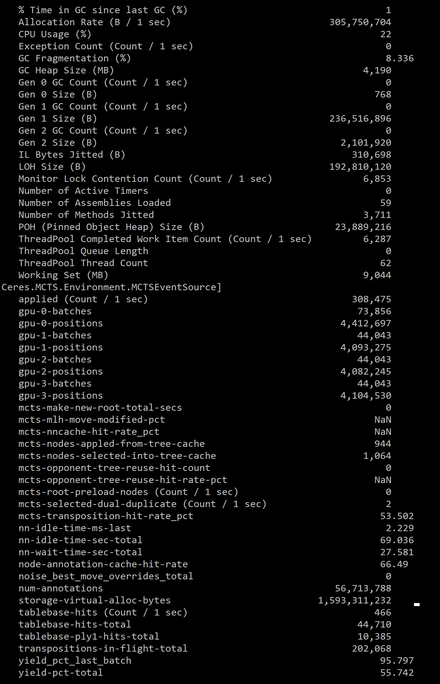

#### Monitoring

If you enable Ceres event monitoring either by editing the Ceres.json
or by issuing the command:
```
ceres setopt launch-monitor=true
```
then subsequently Ceres will attempt to launch a separate process with
a console window that continuously displays statistics related 
to the running Ceres process.

Internally this monitoring is accomplished by Ceres automatically a launching
at startup the .NET utility "dotnet-counters" with a command of the following form:
```
dotnet-counters  monitor --process-id <CERES_PROCESS_ID> Ceres System.Runtime Ceres.MCTS.Environment.MCTSEventSource
```

Note that this requires that this .NET utility have already be installed
 (or updated to the latest version) for example with the following command:
```
dotnet tool install --global dotnet-counters 
```

The output of the montitoring tool consists of two sections. 
The first section show standard statistics associated with the .NET runtime,
such as the memory consumption of the running process.
The second section shows statistics specific to Ceres, such as the
number of nodes evaluated per second. For example:

