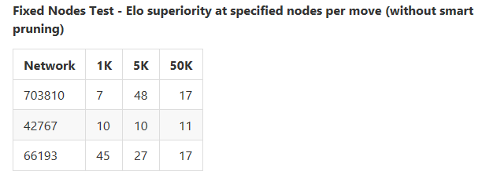
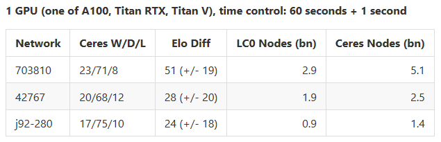
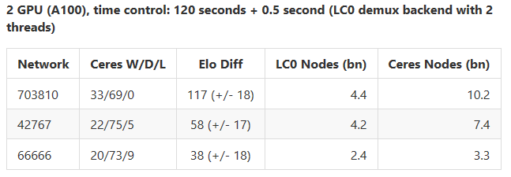
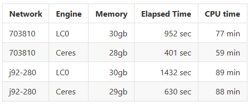
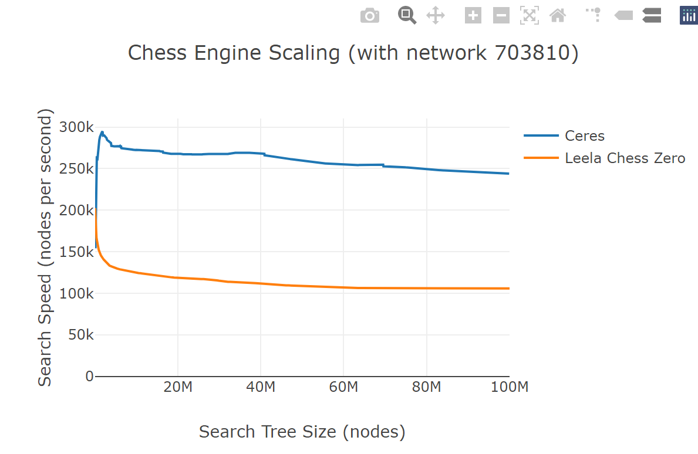
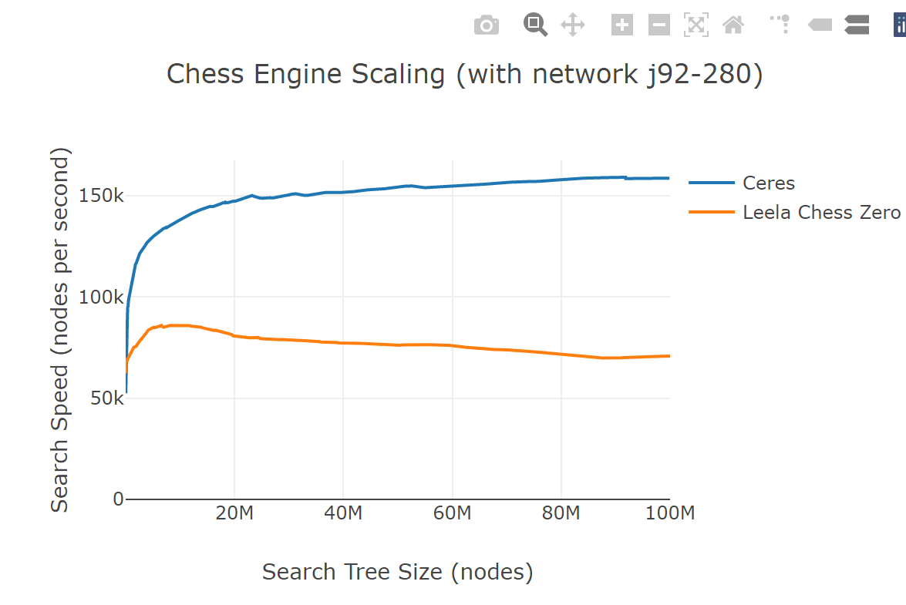

# Ceres - an MCTS chess engine for research and recreation

Ceres ("Chess Engine for Research") is:
*  a state-of-the-art UCI-compliant chess engine employing the AlphaZero-style Monte Carlo Tree Search and deep neural networks
*  a flexible, modular and efficient software library with an exposed API to facilitate research in computer chess
*  a set of [integrated tools](Commands.md) for chess research (e.g for position analysis, suite testing, tournament manager)

The Ceres MCTS engine is a novel implementation written in C# for the Microsoft .NET 5 framework. This system 
comprises about 50,000 lines of source in 400 source code files, developed
as a way to try to make something good come of COVID confinement. The underlying
neural networks (and backend code to execute them) and backend code are currently mostly borrowed from the 
[LeelaChessZero project](https://lczero.org) via a "plug-in" architecture.

It is important to acknowledge that this project stands "on the shoulders of giants" - the pioneers
in the field such as DeepMind with their AlphaZero project and the ongoing Leela Chess Zero project.

Although several fine open source implementations of MCTS engines are currently available, this project
is hoped to provide four important benefits:
* greatly reduce the current "CPU bottleneck" which prevents engines from full utilizing modern high-end GPU hardware
* offer a comprehensive API for chess research, rather than a narrow focus on a UCI engine
* offer an integrated set of tools (such as suite or tournament management) which simplify and accelerate testing of new research ideas
* utilize a modern programming language with features such as automatic garbage collections and development environments 
 that provide edit/compile/debug inner loops which are almost instantaneous

## Caveats

In its first beta release, Ceres software and hardware requirements are fairly restrictive (Windows operating system,
processors with AVX, and NVIDIA GPUs). Currently the installation and configuration burden
is fairly significant and only suggested for hardcore enthusiasts with substantial computer expertise.

Initial testing suggests Ceres play quality is already highly competitive with 
other MCTS chess engine implementations. However these results await independent verification
and could quite possibly be flawed and/or not representative of typical hardware or playing conditions.

The robustness and completeness of the ancillary API and features such as suite and tournament 
testing are considered of approximately beta test quality. However the
robustness and completeness of the core UCI engine is considered near or at production quality,
having been subjected to several months of nearly continuous testing with Cutechess,
Arena, and other tools. The primary limitation in this regard is limited customizability
from the UCI interface (currently no support of set option commands).

## Ceres Software Architecture

The Ceres architecture is object oriented and organized into five layers:
* Ceres.Base - supporting algorithms and data structures not specific to the game of Chess
* Ceres.Chess - generic logic relating to the game of chess, such as move generation
* Ceres.MCTS - highly efficient implementation of Monte Carlo Tree Search
* Ceres.Features - implementations of various supplemental features such as suite and match play
* Ceres - top-level Console mode application with command line parsing to launch desired feature (or UCI engine)

The class library is intended to be reusable and offer comprehensive chess functionality 
to facilitate research, for example including:
* low-level chess concepts such as boards, moves, games, principal variations
* interfaces to external data such as PGN or EPD files, or local/remote neural network files
* a set of neural network position evaluators (including random, ensembled, roundrobin, split, or pooled)
* interfaces to external engines (via UCI) 
* integrated MCTS search engine allowing customization of parameters or introspection of computed search trees
* high-level modules for automated suite or tournament testing

The external API is not yet considered stable. Documentation and samples will
be published in the coming weeks, and feedback is welcomed on design, usability or
requested features.

As a teaser, the following [examples](APISamples.md)
demonstrate how the API can be leveraged to perform complex tasks using 
only a very small number of lines of code.

## Implementation Features

Numerous small to medium-sized features are believed to combine to help deliver 
strong performance of both search speed and play quality, including:

* A novel "dual CPUCT node selection algorithm" is used which alternates between two 
CPUCT levels (centered around the target CPUCT) on each batch, thereby minimizing collisions
(and allowing larger batches) in selected leafs and combining elements of 
greater breadth and depth simultaneously for improved play quality (suggested earlier
by LC0 contributor Naphthalin).

* MCTS leaf selection is highly parallelized in an almost lock-free way, 
with only a single descent and each visited node being visited at most once.

* MCTS leaf selection via PUCT algorithm is accelerated via SIMD hardware intrinsics (AVX),
which is made feasible by the above-mentioned parallelized descent algorithm.

* An overlapping execution approach allows efficient concurrent gathering and evaluation of batches.

* A relative virtual loss technique is used rather than absolute (to reduce the 
magnitude of distortions caused by node selection with virtual loss applied).

* The underlying search tree nodes are represented as fixed-size memory objects
which are cache-aligned and reserved up front by dynamically committed only as needed.
This structure enhances performance and facilitates efficient serialization of search tree state.
The data structures use 32-bit node indices instead of 64-bit pointers to reduce memory consumption
and make one-shot binary serialization possible. A set of "annotations"
are maintained for a cached subset of active nodes, containing derived
information useful in search.

* Transpositions are detected and short-circuited from needing neural network re-evaluation
by copying the neural networks from the nodes already "in situ" in the tree 
(thereby obviating explicit transposition tables or any limit on their size).

* Best move selection is often based on Q (subtree average evaluation) instead of N (number of visits).
Among other benefits, this opens the door to search methods more tuned to BAI (best arm identification) at the root.

* Extensive use is made of fairly fine-grained parallelism to speed up many operations,
using the .NET Thread Parallel Library (TPL) for covenience and high efficiency.

* Critical components of the engine have been extensively optimized with
the help of tools such as Intel vTune and careful attention to processor 
details such as memory alignment, false sharing, NUMA effects, locking primitives, prefetching,
branch prediction, and maximizing instruction-level parallelism.

* The neural network evaluator framework is extensible with current implementations for
executing using random, Leela Chess Zero, and NVIDIA Tensor RT (experimental) backends, 
including a promising prototype 8-bit version.

## Game Benchmarks

Preliminary test results are provided below which attempt to assess the search speed
and play quality of Ceres. However these results require independent verification,
and could quite possibly be flawed, incomplete or not representative.

The results suggest that the improvement in playing strengh is approximatly
equally attributable to greater search speed and minor refinements in the
search algorithm.

Details:

* The hardware used was dual Intel® Xeon® Gold 6142 Processor 
an done or more NVIDIA GPUs as detailed below with each test.

* LC0: version 0.26.3 configured with default settings 
except cache size 5,000,000, and 6 man tablebases.

* Ceres: default settings plus 6 man tablebases.

* Openings: 50 openings from TCEC 19 (each engine plays both side)

                                                  

## Scaling benchmarks

Searches were run to 100,000,000 nodes from the starting position
(with smart pruning turned off) using mulitple GPUs(A100 + A100 + Titan RTX + Titan X).
The roundrobin backend with 5 threads was used with LC0.

s

## Speculation on the implications of Ceres for high-end chess play

How might Ceres impact high-end chess? The implications are unclear. On the one hand,
we already have very strong engines in the two major styles: Stockfish with alpha beta,
and LC0 with neural network/MCTS. When playing at the long time controls
an big hardware the phenomenon of Elo compression is very apparent. Therefore possibly
incremental gains will be limited.

However there are other possible reasons why perhaps the impact of Ceres enhancements 
(especially greater speed) might be more impactful than otherwise expected:
* top tournaments are played at 20x or more longer time controls than those tested so far,
 and the speed improvements of Ceres are most apparent in longer searches
* the speed of GPUs continues to increase at a rapid pace, making faster search more important over time
* potentially low precision (Int8) neural networks will become practical in the near future, increasing
nodes per second by about 70%, which can be effectively utilized with a faster engine, and
* the tests performed so far are all against an MCTS opponent but one might speculate that
the benefits of deeper search to avoid missing tactics will be even more important against 
an alpha/beta style engine such as Stockfish.

## Configuration and Installation

The setup [instructions](Setup.md) describe the sequence of steps
currently needed to install and configure Ceres.

## Monitoring Tool
Event logging and statistics collection are very useful (and interesting) tools.
Ceres provides an optional realtime [monitoring](Monitoring.md) system.

## Contributing
It is hoped that Ceres will be a community effort. At this early stage, it probably 
does not make sense to be soliciting a large number of small improvements. Instead
it is suggested that contributions would be most useful in the following areas:

* testing of installation and operation on heterogeneous software/hardware environments
* testing against alpha/beta engines such as Stockfish
* feedback on the (limited) documentation provided so far
* opening issues to identify any bugs or anomalies noted in testing
* independent assesment of Ceres actual performance (speed and play quality)
* comments on the design and API surface
* suggestions for the most needed missing features

Somewhat bigger picture, thoughts and help with the architeture and implementation of backends would be 
especially welcomed. Some open questions/opportunities:
* extend the LC0 backend support beyond just CUDA
* possibly generalize the interface between LC0 backends and arbitrary clients so this large and
 complex set of backends could be more widely leveraged by other chess engines
* even more generally, write a direct translator from LC0 weights files to ONNX files which 
would then allow execution via TensorRT or ONNXRUNTIME across a wide variety of 
hardware devices

## Acknowledgements and Thanks

It goes without saying that Ceres builds on the work of many other researchers
and software developers, most notably:
* DeepMind's Alpha Zero project (for the basic architecture and search algorithms)
* Leela Chess Zero project for the neural networks and backends for inferencing with those networks
* Judd Niemann for the move generator code (translated and adapted from C++) (https://github.com/jniemann66/juddperft)
* Microsoft for the elegant C# language, performant .NET runtime, and excellent set of free software development tools such as Visual Studio

## License

Ceres is free software: you can redistribute it and/or modify
it under the terms of the GNU General Public License as published by
the Free Software Foundation, either version 3 or later of the License, or
(at your option) any later version.

Ceres is distributed in the hope that it will be useful,
but WITHOUT ANY WARRANTY; without even the implied warranty of
MERCHANTABILITY or FITNESS FOR A PARTICULAR PURPOSE.  See the
GNU General Public License for more details.

You should have received a copy of the GNU General Public License
along with Leela Chess.  If not, see <http://www.gnu.org/licenses/>.

### Additional permission under GNU GPL version 3 section 7

_The source files of Ceres have the following additional permission, 
as allowed under GNU GPL version 3 section 7:_

If you modify this Program, or any covered work, by linking or
combining it with NVIDIA Corporation's libraries from the NVIDIA CUDA
Toolkit and the NVIDIA CUDA Deep Neural Network library (or a
modified version of those libraries), containing parts covered by the
terms of the respective license agreement, the licensors of this
Program grant you additional permission to convey the resulting work.

